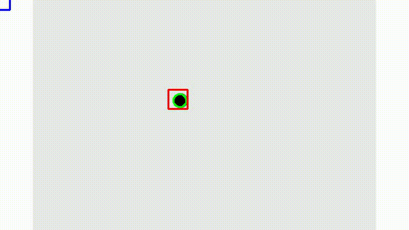

# Visual Object Tracking: Project report on TPs 1–4
### Author: Alexis Petignat, 2025

This report presents the work done during the four practical sessions (TPs) of the Visual Object Tracking course. The main objective was to implement various object tracking algorithms on video sequences, such as the Kalman Filter, IoU-based multi-object tracking, and deep learning–based tracking. Below is a summary of each TP, the implementation process and the difficulties encountered.

---

## TP1: Kalman Filter for Object Tracking

The Kalman Filter is a recursive algorithm used for estimating the state of a dynamic system based on noisy measurements. The goal of this TP was to implement a basic Kalman Filter for tracking a single object in a simple video scene.

### Implementation
- The first step was building the `KalmanFilter` structure. This included defining the state vector, measurement vector, and the necessary matrices (state transition, observation, process noise covariance, and measurement noise covariance). The state vector included the position and velocity of the object. No major difficulty occurred here.
- The next task was to implement the `prediction` function, which, due to the simple implementation of the filter, was straightforward. The state was predicted using the state transition matrix. The prediction was passed through the state matrix, which is not necessary for the update function.
- The update function was the next task. This is where issues started arising. I had some issues with the theory behind the function, which caused several wrong implementations of the function. The main issue was how the coordinates were passed to the function, which was a squeezed array, causing a dimension mismatch that took me some time to debug. Once this was fixed, the function started working correctly.
- Finally, the Kalman Filter was integrated into the tracking pipeline. The filter was initialized with the first detection of the object, and then for each subsequent frame, the prediction and update functions were called to track the object. The results were visualized by drawing bounding boxes around the tracked object. At first, the predicted box was moving on a straight line at the bottom of the screen, which was due to a wrong indexing in the update method which was quickly fixed. Once this was fixed, the tracker started working as intended but I noticed somethiing was off with the prediction, which always seemed to lag behind the actual position of the object. After some debugging, I realized I was passing my predicted state from the step before instead of my updated state from this state. Once this was fixed, the tracker worked perfectly as expected.

### Results
The Kalman Filter tracker successfully tracks the object throughout the sequence. The predicted bounding boxes closely follows the true detections, demonstrating the effectiveness of the filter in a simple scenario.  
The red box represents the actual detection and the blue box is the Kalman prediction.

---

## TP2: Multi-Object Tracking using IoU-Based Data Association

IoU (Intersection over Union) is a metric used to evaluate the overlap between two bounding boxes. The goal of this TP was to implement a multi-object tracker using IoU-based data association along with the Hungarian algorithm. The detections were provided in a CSV file.

### Implementation
- To structure the problem, I created several classes:  
  1. *Point*: represents a 2D point with integer x and y coordinates.  
  2. *BoundingBox*: defined by its top-left and bottom-right corners.  
  3. *Track*: represents a tracked object, with an ID, a bounding box, and a counter for missed frames.  
  4. *TrackList*: This class was originally created to manage a list of tracks, including adding new tracks, updating existing tracks, and removing dead tracks. However, I ended up not using it as I found it easier to manage the list of tracks directly with a python list, which ended up working smoothly.

- Once these structures were created, I started implementing the main tracking loop. First, I loaded all the detections and mapped them to bounding boxes. I also implemented a function that, for two given bounding boxes, computes their IoU. This function was straightforward to implement and did not pose any issues thanks to stack overflow.
- Next, I handled the starting case where no tracks were present. In this case, I simply created a new track for each detection in the current frame.
- For subsequent frames, I computed the IoU between each existing track and each detection, storing the results in an IoU matrix. The cost matrix was obtained with $1 - \text{IoU}$.
- I then used the *Hungarian algorithm* to find the optimal assignment between tracks and detections based on the cost matrix. This was implemented using the `scipy.optimize.linear_sum_assignment` function, which made it easy to implement without any issues. I did get a problem with me getting confused with the IDs from the hungarian algorithm, the track IDs, and the detection IDs since I did not know which one to associate, causing tracks to constatntly change their IDs. After some debugging, I realized I had to use the indices returned by the Hungarian algorithm to map back to the original track and detection IDs.
- The result was correct. For better associations, I set a threshold on the IoU values to determine whether a track and detection should be associated. If the IoU was below this threshold (set to 0.3), the association was discarded and no box was displayed.
- The final result works very well. The tracks are well associated with the detections and the IDs on the video are coherent. The only issue I noticed is that when two objects cross paths, the tracker sometimes swaps their IDs. The boxes are also shaking a bit, which is normal since no prediction is done between frames. Overall, the tracker performs well in this multi-object tracking scenario with given detections.
- Finally, each detection from the file was associated with a track and stored in a separate file, stored in `./ADL-Rundle-6/gt/tp2_det.txt`.

### Results
The IoU-based multi-object tracker was able to successfully track multiple objects throughout the video sequence. The bounding boxes were correctly associated with the detected objects, and the tracker was able to maintain consistent IDs for each object. Below is a visualization of the tracking results. Each bounding box is labeled with its corresponding track ID.

---

## TP3: Kalman Filter with IoU-Based Data Association for Multi-Object Tracking

This TP combined the previous two: a Kalman Filter was added to each track to improve prediction and overall stability.

### Implementation
- I refactored the code to make it cleaner. The cost matrix computation and frame-rendering logic were extracted into separate functions.
- I extended the `BoundingBox` class to be able to compute its own center, as well as shift the box based on the Kalman prediction of a new box center. Each `Track` now included its own Kalman Filter.
- The logic was non trivial and had me thinking for a long time, but I eventually isolated that I had to handle three cases:
  1. **Matched detections**: Matched detections were the first case I handled. These detections can be defined as those with a great IoU with an existing track. For these detections, I updated the corresponding Kalman Filter with the detection's center as the measurement. After updating the Kalman Filter, I obtained the predicted state and used it to update the bounding box of the track. The updated box was displayed on the frame with its ID, and the predicted box was stored as the track's bounding box for better IoU score at the next step. I did not encounter issues with this part.

  2. **Unmatched detections**: Unmatched Detections: Unmatched detections were the next case I handled, and also the trickiest one. These detections can be defined as those with a low IoU with all existing tracks, and can be considered as new objects entering the scene. For these detections, a new track is created and initialized with a new Kalman Filter with the detection's center as the initial state. The new track was added to the list of existing tracks, and its bounding box was displayed on the frame with a new ID. The main issue I encountered here was detecting which detections were unmatched. I initially tried to do this by checking the IoU values, but it was error-prone and led to incorrect associations quite often. The solution I opted for was to store all detections that were matched during the previous step, and then simply check which detections were not in this list. This approach worked much better, once I figured out a way to manage the track IDs in a better way, since my previous implementation did not allow to assign IDs to tracks the way I needed.

  3. **Unmatched tracks**: Unmatched tracks were the final case I handled. This was also the easiest one by far. The intended way to handle unmatched tracks is to increase their "missed frames" counter, and if this counter exceeds a certain threshold, the track is considered dead and removed from the list of existing tracks. But instead of doing this, I simply considered all tracks as unmatched at the beginning of the step, increasing all the missed counters by one. Then, during the matched detections step, I reset the counter for matched tracks back to zero. Finally, at the end of the loop, I removed all tracks with a missed frames counter exceeding a threshold and for thoses which did not reach this threshold, I displayed the prediction of the Kalman Filter on the frame, to infer the object's position. This approach worked well and simplified the logic significantly.

- Overall, the integration of the Kalman Filter into the IoU-based multi-object tracker improved the tracking performance, resulting in smoother trajectories and more consistent IDs for each object. Although, I noticed that some boxes would appear out of nowhere and go across the screen with high velocity. This was most likely due to detections of a weird object for a few frames, causing the Kalman Filter to predict a high velocity for the object (whether it actually existed or not). To fix this, I added a counter to the Track class that counts the total number of frames where a detection was matched with the track. This allowed to set up a threshold to assert that all predictions could only be displayed if the track had been matched at least a certain number of times, which guaranteed that the track was actually valid, and not some "phantom" track.

### Results
The integration of the Kalman Filter produced smoother trajectories and more consistent IDs. Although some phantom boxes moving across the screen still appeared in dense scenes, the overall result was noticeably better than TP2. Below is a visualization of the tracking results. Each bounding box is labeled with its corresponding track ID. When a bounding box is inferred, the word "Predicted" is displayed next to the ID.

---

## TP4: Deep Learning-Based Object Tracking with IoU and Kalman Filter

This TP was to go even further beyond the previous TPs by integrating a Deep Learning-based object detector into the tracking pipeline. The goal was to use a pre-trained object detection model to provide a similarity score for data association, instead of relying solely on the IoU metric. The Kalman Filter would still be used for predicting object positions between frames.

### Implementation
- The changes in the code were minimal. The only function I changed is the function that computes the cost matrix, which now also computes the *cosine similarity* for each pair of track and detection feature vectors. The cost matrix was then computed as a weighted sum of the IoU cost and the cosine similarity cost, with weights defined as hyperparameters ALPHA and BETA (set to 0.7 and 0.3, respectively).
- The *feature extraction* process required some preprocessing beforehand. First, each bounding box was cropped from the frame and resized to the input size expected by the model (64x128). The cropped image was then normalized using the mean and standard deviation values provided in the TP instructions. Finally, the preprocessed image was passed through the model to obtain the feature vector. I had several issues with this part, due to image boxes being out of bounds of the image, especially with predictions since these are inferred and fixed on the velocity of the object. Several fixed were required to prevent this. I clamped the box coordinates to always be positive and stay in bounds of the image. This was not a trivial task since I had implemented operators for Points, which also had to be changed. Another issue I faced were boxes with zero area (corners sharing an x or y coordinate), which caused errors during resizing. To fix this, I added a check to ensure that the width and height of the box were at least 1 pixel before cropping and resizing (this would only occur on the edges of the picture, and most likely apply to only objects which left the scene).
- At this point, the code was working but it was extremely slow. I ended up realizing that calling a forward pass on the model for each couple of box, for each frame, was extremely inefficient. To fix this, I decided to precompute all feature vectors for all detections in the current frame before computing the similarity matrix in one call to the cosine similarity function from sklearn. This change drastically improved the speed of the tracker.

### Results
Combining appearance features with IoU and Kalman prediction improved data association, reducing ID switches and producing more stable tracking results in crowded scenes. Below is a visualization of the tracking results. Each bounding box is labeled with its corresponding track ID. When a bounding box is inferred, the word "Predicted" is displayed next to the ID.

---

# Conclusion

These TPs were a great opportunity to learn and implement various object tracking algorithms. Starting from a basic *Kalman Filter* for single-object tracking, we progressed to more complex multi-object tracking scenarios using **IoU-based* data association and finally integrated *Deep Learning-based* object detection for improved tracking performance. My personal favorite was TP3, since it already felt like a high quality object tracking system, with smooth predictions and good ID consistency. TP4 was also interesting, but the performance gain was not as significant as I expected, and the implementation was extremely straightforward compared to TP3. I liked a lot working on these TPs, they were challenging but rewarding, and I feel that I have gained a solid understanding of object tracking techniques and their practical applications.